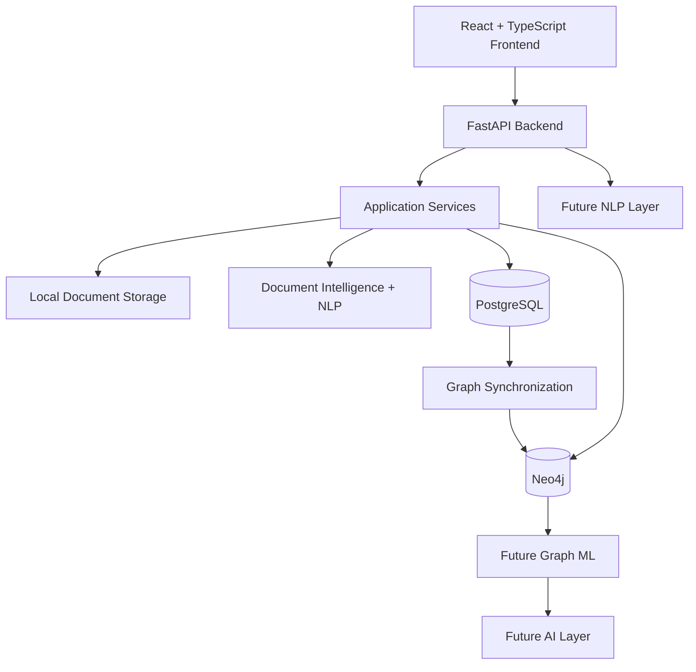

# VEIL Architecture

VEIL, Visualizing Evidence & Intelligence Links, is structured as a modular investigation platform. Phase 3 adds document ingestion, deterministic NLP extraction, entity resolution, review workflows, and evidence-backed graph updates.

## System Overview



## Frontend

The frontend lives in `frontend/` and uses React, TypeScript, Vite, React Router, and Tailwind CSS. Phase 2 includes a lightweight internal graph test page for fetching case graphs, neighbor graphs, centrality results, communities, and bridge candidates. It does not include a polished graph explorer, map, timeline, or AI assistant.

## Backend

The backend lives in `backend/` and uses FastAPI, Pydantic Settings, SQLAlchemy, Alembic, Neo4j, and NetworkX. Routes are organized under `backend/app/api`, relational persistence under `backend/app/models` and `backend/app/repositories`, and graph logic under `backend/app/graph`.

## PostgreSQL Role

PostgreSQL remains the source of truth for application metadata and persisted investigation records. It stores cases, entities, documents, evidence, alerts, communications, and transactions.

## Neo4j Role

Neo4j stores graph projections for traversal and network analysis. Graph nodes use stable IDs such as `P001`, `C001`, and `DOC001`; names are never used as unique identifiers. Relationships carry provenance fields so a user can ask why a relationship exists.

## Graph Synchronization

The synchronization flow is:

```text
PostgreSQL -> GraphSyncService -> GraphRepository -> Neo4j
```

`scripts/sync_graph.py` creates constraints, upserts nodes, and merges relationships by stable IDs. It is safe to run repeatedly because Neo4j `MERGE` prevents duplicates.

## Analytics

Network analytics are calculated from a bounded Neo4j projection using NetworkX:

- Degree centrality: direct connectivity.
- Betweenness centrality: possible bridge position between graph areas.
- PageRank: structural graph importance, not suspicion or criminality.
- Community detection: modularity-based grouping of connected areas.
- Bridge detection: high-betweenness nodes connected across communities.
- Structural importance: transparent blend of degree, betweenness, and PageRank.

## Document Intelligence

The document pipeline is:

```text
Upload -> Validate -> Store -> Extract Text -> Clean Text -> Extract Entities
-> Normalize -> Resolve Matches -> Extract Relationships -> Create Evidence
-> PostgreSQL -> Graph Sync -> Neo4j
```

Phase 3 uses deterministic rules for extraction and entity resolution. spaCy, transformer models, OCR, and LLM extractors remain extension points. The system does not invent unsupported facts; extracted items include source references, offsets, confidence, and context snippets.

## Review Workflow

Entity matches are stored in `entity_matches` with transparent matching signals. Decisions are limited to `ACCEPT`, `REJECT`, and `DEFER`, and are recorded in `review_audit` with `actor_type = demo_investigator` until authentication exists.

Individual extracted entities and extracted relationships can also be reviewed directly. Accepted/rejected/deferred decisions update extraction status and preserve an audit record without silently merging identities.

## Future AI/ML and NLP Layers

The `ml/` and `nlp/` backend packages are extension points for later phases. They are intentionally empty in Phase 1 apart from package initialization.

## Behavioral Intelligence

Phase 4 follows `PostgreSQL -> feature engineering -> analysis -> AnalyticsResult snapshot -> explainable Alert -> investigator review`. The FastAPI routes delegate calculation to `BehavioralAnalyticsService`; feature and model logic remains under `backend/app/ml/`.

Transaction analysis uses a fixed-seed Isolation Forest. Communication and temporal signals use deterministic daily deviation rules, while geographic signals use Haversine distance. Investigation Priority is an analytical review priority, not a statement or probability of criminality. It reweights only available components and returns a data-sufficiency note.

## Data Flow

1. The frontend calls FastAPI endpoints.
2. FastAPI routes delegate to services and repositories.
3. PostgreSQL stores canonical application records.
4. Neo4j stores selected graph projections for traversal and analytics.
5. Future AI/NLP services will consume persisted documents and graph context through explicit service boundaries.

## Security Considerations

No authentication is implemented in Phase 1. Secrets are read from environment variables and `.env` is ignored. Demo data is synthetic and avoids real personal data or full bank account numbers.

Graph queries validate depth and limit parameters to avoid accidental large traversals. Cypher labels and relationship types are validated before use, and user values are passed as parameters. Later phases should add authentication, authorization, audit logging, secure file handling, encryption strategy, and data retention controls.

## Scalability Considerations

The split architecture allows independent scaling of frontend, API, relational storage, and graph storage. PostgreSQL indexes are limited to fields needed for early query paths. Neo4j is isolated behind a repository abstraction so graph projections can evolve without tightly coupling the relational schema to graph analytics.

## Phase 5 Frontend Architecture

The React application uses a persistent shell and a small `CaseContext` for current investigation scope. Domain API calls are centralized in `frontend/src/services/api.ts`; typed contracts live under `frontend/src/types`. Pages own local filters and selection state.

`/api/workspace` is a bounded read layer over canonical PostgreSQL records. It supplies dashboard aggregates, cases, relational entity profiles, evidence, documents, timeline events, location events, and categorized global search. Existing graph, analytics, alert, and document APIs remain authoritative for their domains.

Cytoscape renders graph API nodes and relationships with a 500-node ceiling and lazy neighbor expansion. Leaflet renders only backend geocoded events and chronological movement paths. Both visualization bundles are route-level lazy chunks. API-driven views include loading, empty, and retryable error states.
