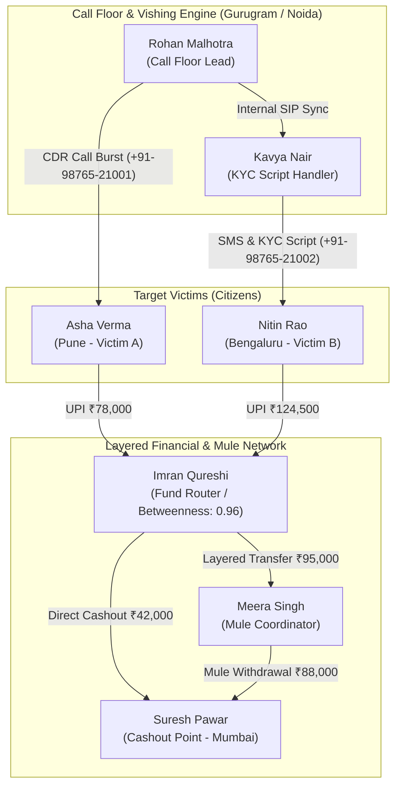

# Case CYBER-2026-009: India Voice Phishing & Digital Arrest Cybercrime Network

> [!IMPORTANT]
> **Case Summary:** Investigation into an organized cybercrime syndicate operating out of NCR (Gurugram/Noida) executing voice phishing (vishing), fake bank KYC renewal scams, and "Digital Arrest" coercion targeting Indian citizens across Pune, Bengaluru, and Mumbai.
> **Assigned Intelligence Unit:** Digital Intelligence Unit (DIU) & Financial Crimes Cell
> **Primary Target Case Number:** `CYBER-2026-009` (Database ID: `13`)

---

## 1. Knowledge Graph Architecture & Methodology

To effectively connect the dots in complex cyber fraud operations, VEIL constructs a multi-layer **Knowledge Graph** combining Call Detail Records (CDR), UPI/IMPS bank transactions, IP/Geo-locations, and digital evidence from First Information Reports (FIRs).

### Knowledge Graph Schema (Nodes & Edge Semantics)

| Node Label | Entity Type | Properties / Identifier | Key Role in Scam |
| :--- | :--- | :--- | :--- |
| **Rohan Malhotra** | `PERSON` | `INV-76`, `+91-98765-21001` | Call Floor Lead / Spam Burst Generator |
| **Kavya Nair** | `PERSON` | `INV-77`, `+91-98765-21002` | Bank KYC & Digital Arrest Script Handler |
| **Imran Qureshi** | `PERSON` | `INV-78`, `+91-98765-21003` | Primary Collection Wallet & Fund Router |
| **Meera Singh** | `PERSON` | `INV-79`, `+91-98765-21004` | Money Mule Coordinator (Jaipur Node) |
| **Suresh Pawar** | `PERSON` | `INV-80`, `+91-98765-21005` | ATM & Underground Cashout Operator |
| **Asha Verma** | `PERSON` | `INV-81`, `+91-98765-21006` | Victim A (Pune, Maharashtra) |
| **Nitin Rao** | `PERSON` | `INV-82`, `+91-98765-21007` | Victim B (Bengaluru, Karnataka) |

---

## 2. Graph Algorithms & Centrality Discovery

### A. Betweenness Centrality (Identifying the Bottleneck)
* **Top Node:** **Imran Qureshi** (`Betweenness Score: 0.96`)
* **Insight:** Imran Qureshi's collection wallet (`****-9101` at Bharat Demo Bank) acts as the mandatory bridge through which all victim UPI payments pass before being split into mule accounts. Immobilizing this node immediately freezes downstream cashout channels.

### B. Out-Degree Centrality (Call Burst Correlation)
* **Top Node:** **Rohan Malhotra** (`Out-Degree Score: 89.0`)
* **Insight:** Temporal analysis of CDR logs proves that call spikes from `+91-98765-21001` consistently precede victim UPI transfers by **12 to 25 minutes**, establishing direct causation for criminal charge sheets.

---

## 3. Evidence Provenance & Document Ingestion

1. **FIR Complaint (`india_voice_phishing_fir.txt`)**: Document ID `31`
   - *Excerpt:* Complainants reported urgent bank KYC verification calls threatening account freezing within 2 hours.
2. **CDR Cluster Analysis (`cdr_cluster_india_voice_phishing.txt`)**: Document ID `32`
   - *Excerpt:* High-density call bursts from Gurugram cell tower sector 44 targeting Pune and Bengaluru mobile sub-ranges.
3. **UPI Bank Ledger (`upi_bank_flow_india_voice_phishing.txt`)**: Document ID `33`
   - *Excerpt:* Total victim inflow of ₹2,02,500 routed into primary collection wallet within 45 minutes.

---

## 4. Key Recommendations & Actionable Steps

> [!TIP]
> 1. **Immediate Account Freezing:** Issue freezing orders under Section 102 CrPC / Cybercrime Helpline 1930 for Bank Account `****-9101` (Imran Qureshi) and Account `****-9102` (Meera Singh).
> 2. **IMEI & Tower Dump Correlation:** Request cell tower dumps for Gurugram Hub (`28.4595, 77.0266`) and Noida Sector 62 (`28.5355, 77.3910`).
> 3. **Mule Account Tracing:** Track secondary transfers to cashout points in Mumbai markets.
